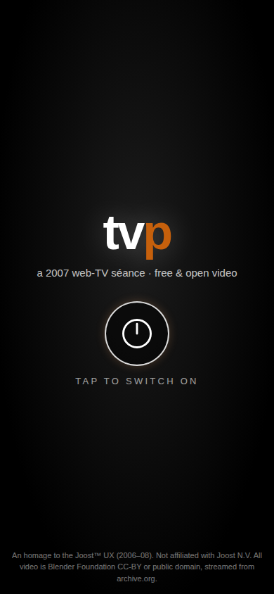
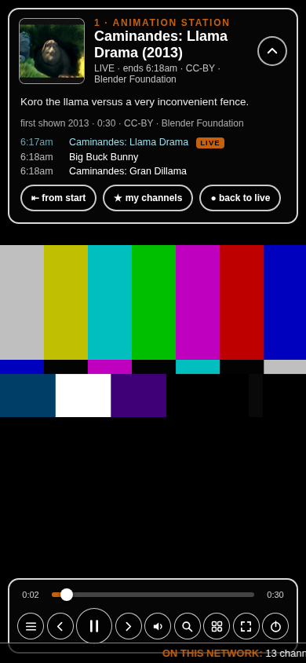
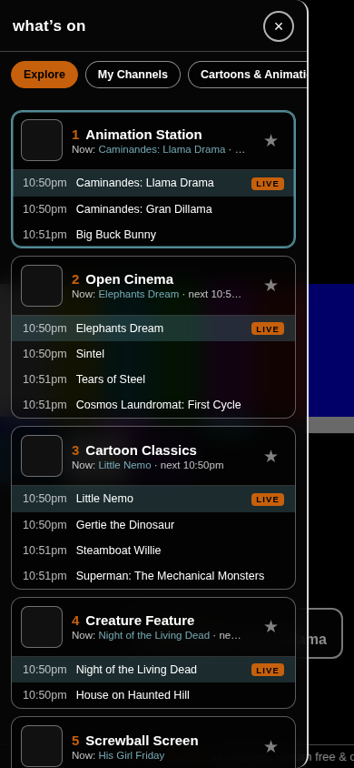
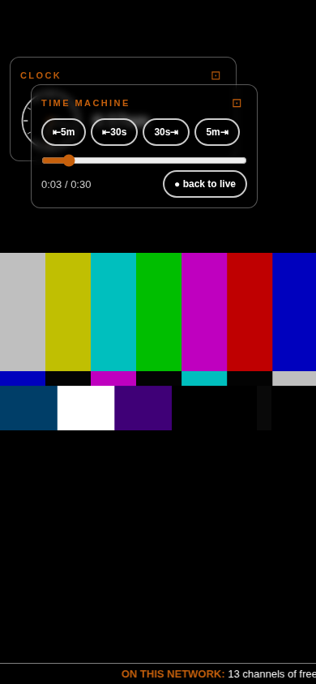

# tvp/ — raising the ghost of Joost (2006–2008)

This directory holds a small act of software necromancy:

1. **`joost0.13.096614.dmg`** — an original Joost beta installer for Mac OS X
   (version 0.13.0.96614, built 2007-09-21), kept as a historical artifact.
2. **`app/`** — a brand-new, mobile-first web app that resurrects the Joost
   *user experience* using only free and open video streamed from the
   Internet Archive.
3. **`tools/curate.mjs`** — the content harvester that builds the channel
   dial from archive.org collections.

**[▶ Open the player](app/index.html)** — serve `app/` with any static file
server (`python3 -m http.server`, GitHub Pages, etc.) and tap the power button.

| splash | live + controller | channel guide | widgets |
|---|---|---|---|
|  |  |  |  |

---

## Part 1 — the archaeology

The `.dmg` is a UDIF/HFS+ image; `7z x joost0.13.096614.dmg` extracts it
(the extracted tree is intentionally **not** committed — see *Legal*, below).
Inside `Joost.app` there is no bespoke C++ UI at all. The whole client is a
**XULRunner application** (Gecko 1.9a5pre) — essentially a single-purpose,
chromeless Firefox rendering the UI as XUL + SVG + HTML sprites composited
over the video plane:

```
Joost.app/Contents/Resources/
├── application.ini            Vendor=Joost N.V. (formerly Baaima N.V.)
├── anthill_primed_channel.rdf the pre-seeded "Welcome" channel (RDF!)
└── chrome/
    ├── tvp-ui.jar             the entire UI: tvp.xul + ~100 JS/XBL files
    ├── tvp-en-US.jar          locale: strings, EPG categories (CSV)
    └── tvprdf.jar, tvpzelos…  data layer, services
```

Things learned from `tvp.xul` and friends, all echoed in the recreation:

- **A `<compositor>` full of `<sprite>`s** — controller, EPG, menu, OSD,
  interstitial, "coming up" overlay, error panels — all floating over
  full-bleed video. Recreated as absolutely-positioned overlays over a
  fullscreen `<video>`.
- **The full-screen channel menu** with large content tiles you sweep
  through — recreated as the "swoosh" guide: a snap-scrolled carousel of
  big program-art tiles over the still-playing picture, category rail on
  top, listings below.
- **Theme constants** (from the locale DTD): font `Trebuchet MS`, frame
  stroke `white`, focus color `rgb(198,96,12)`, translucent black panels
  with 2px white borders, teal selection `rgba(98,163,176,.8)`.
- **Hot edges** (`hotedges.xml`): mousing to screen edges summoned menus.
  Mobile translation: swipe from the left edge → guide, right edge →
  widgets, tap → controller, swipe up/down → zap.
- **The widget/plugin ecosystem** (`widget-manager.js`): channel chat,
  clock (`canvasclock.js`), news ticker, ratings, trivia — plugins that
  could stay **pinned over the picture**. Recreated: every widget has a
  pin (⊡) that floats it over the video, translucent and draggable, with
  positions remembered. A "time machine" widget seeks ±30s/±5m, scrubs to
  any offset, and jumps back to the live broadcast clock.
- **The top info bar** that slides down into a larger panel — recreated:
  the chevron expands it into program details, schedule and actions.
- **The little theatrics**: "Fetching your channel…" interstitials, the
  white-dot CRT power-off, big OSD channel digits, the "coming up" toast,
  five-jewel ratings, `search.noResults1=Your search for "%S" did not
  match any programs.` All back.

## Part 2 — the séance (`app/`)

Zero dependencies, zero build step: one HTML file, one stylesheet, two JS
files. Works as a static page anywhere.

**Broadcast simulation** — the defining Joost feeling was *television*:
you tune in and something is already on. Every channel runs on a wall
clock anchored to `2007-01-16T00:00Z` (the day The Venice Project became
Joost). Tuning computes `(now − epoch) mod playlist-length` and joins the
current program at the right offset. The guide shows real start times and
LIVE tags. **⊢ from start** drops out of the broadcast into on-demand;
**● back to live** rejoins the schedule.

**Making archive.org feel fast** — the tricks, in order of appearance:

1. **Light derivatives always start the show.** Every tune begins on the
   ~512kbps H.264 derivative, which starts in a fraction of the time of
   the originals. With the quality widget on *best*, the player then
   **upgrades mid-play**: the backstage element buffers the big encoding
   a few seconds ahead and swaps over seamlessly (start low, finish high).
2. **Double-buffered video.** Two `<video>` elements: one on the air, the
   other quietly preloading. It stages, in priority order: the next
   program ~45s before the junction (seamless transitions), the quality
   upgrade, and — when idle — the **next channel up the dial** at its
   live offset, so swipe-zapping is warm. Browsing the guide warm-preloads
   whichever channel is centered.
3. **The splash preloads.** While "tap to switch on" breathes, the saved
   channel's live stream is already buffering — power-on typically swaps
   straight onto a warm stream (~150ms to picture in tests).
4. **`preconnect`** to archive.org so the first byte arrives sooner.
5. **Bring-your-own CDN.** Archive.org's own servers are the remaining
   bottleneck (single US origin, throttled ranges). The player has a
   mirror hook: put a caching proxy in front of `archive.org/download/`
   (e.g. a Cloudflare Worker with R2/cache, or any nginx `proxy_cache`)
   and point the player at it once from the console:

   ```js
   localStorage.setItem('tvp.mirror', JSON.stringify('https://your-mirror.example/ia/'))
   ```

   Every stream URL swaps `https://archive.org/download/` for your prefix.
   (Mind Cloudflare's ToS: video proxying belongs on R2/Stream rather than
   the plain CDN free tier.)

**The dial** is generated by [`tools/curate.mjs`](tools/curate.mjs), which
harvests archive.org collections (Prelinger, Film_Noir, SciFi_Horror,
Comedy_Films, classic_tv, universal_newsreels, classic_cartoons,
silent_films, NASA…), keeps family-friendly titles with verified
range-streamable MP4 derivatives and plausible durations, de-duplicates,
and writes `app/js/channels.js` — currently **a dozen+ channels and
100+ programs (~70 hours of airtime)**. Re-run it any time:

```
cd tvp/tools && node curate.mjs        # or --dry to preview
```

**Controls**

- *Touch*: tap = controller · swipe ↑/↓ = zap · swipe from left edge =
  guide · right edge = widgets · pin (⊡) a widget to float it, drag by
  its title · chevron on the top bar = big info panel.
- *Keyboard*: `0–9` channel digits · `↑/↓` zap · `←/→` seek · `space`
  pause · `m` mute · `f` fullscreen · `g` guide · `w` widgets · `i` info
  panel · `/` search · `p` power off.

## Legal

- The `.dmg` is preserved unmodified as a historical artifact of a
  discontinued service; its **extracted contents are proprietary**
  (© Joost N.V. / Joost Technologies B.V.) and are deliberately excluded
  from version control (`.gitignore`).
- `app/` is **original code** — a UX homage; no Joost code, artwork or
  trademarks reproduced. Not affiliated with or endorsed by Joost N.V.
- Video: Blender Foundation open movies are CC-BY. Harvested items come
  from the Internet Archive's public collections (Prelinger and other
  public-domain-era material); each program links its archive.org source.
  If something shouldn't be on the dial, remove it from `tools/curate.mjs`
  and re-run.
